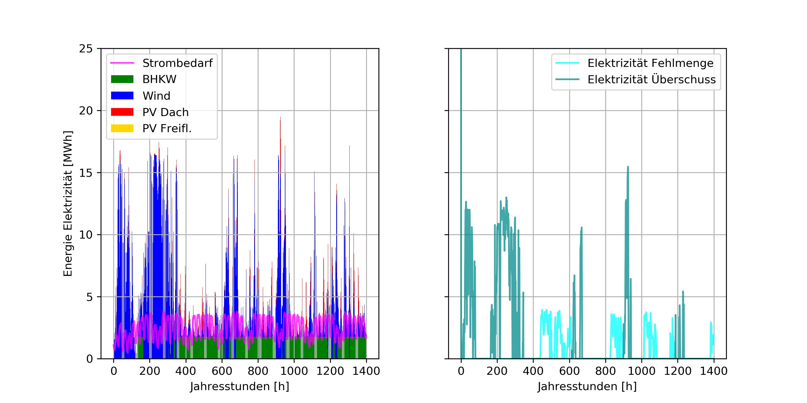
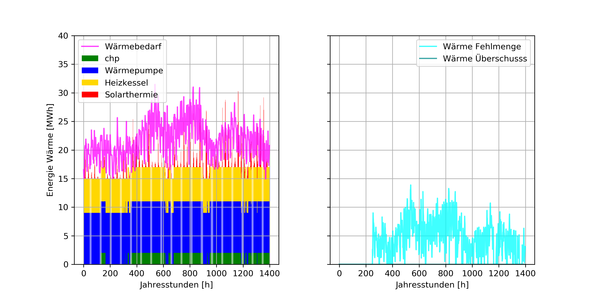
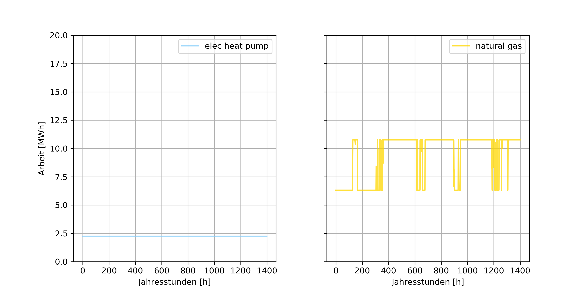

# Energy system simulation of city

This simulation was the outcome of an univerity project on simulating the energy system of a city 
based on demand and supply by different components.

It is based on OEMOF (Open Energy Modeling Framework) for Python.

### How it works
In /data you can find the weather_data.csv the simulation is based on, gneral_parameters.csv
contains data on model components like cost or effieciency. In design_parameters.csv you can 
determine the components (type, number) of the energy system.

The model will simulate based on hourly demand and supply for a year. It calculates yearly 
CO2-emissions, cost of energy, and degree of self sufficiency.

In /results you will find plots of demand and supply by components of elecricity, heat and recources.

### Example

-- Results --   
CO2-Emission: 8936.12 t/a   
Total Costs of Energy System per Year: 21.10 Mio. €/a   
Self-Sufficiency: 94.90 %   

